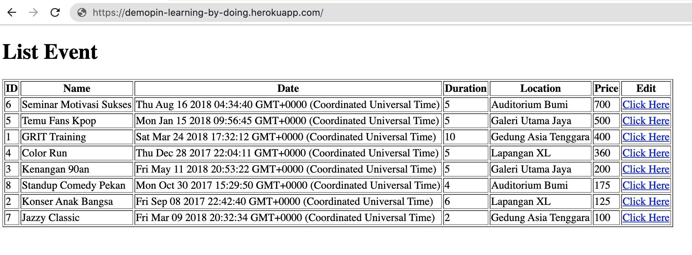
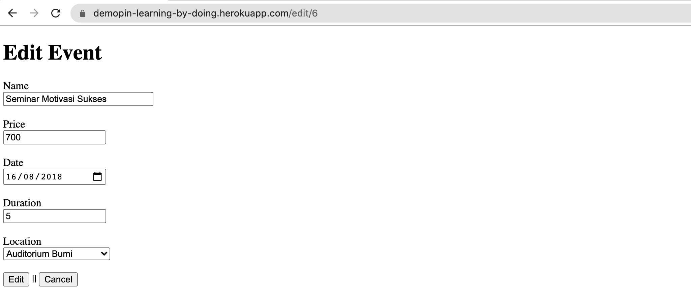
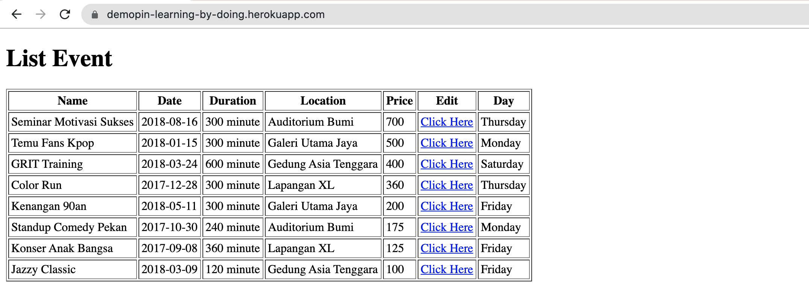

# Edit Event

<u>[Check Demo](https://demopin-learning-by-doing.herokuapp.com/) </u> 

**Buat aplikasi untuk latihan "Edit"** 👍

Terdapat table `"Events"` dalam database seperti berikut

| Column Name | Data Type          |
|-------------|--------------------|
| id          | SERIAL PRIMARY KEY |
| name        | VARCHAR            |
| date        | DATE               |
| duration    | INTEGER            |
| location    | VARCHAR            |
| price       | INTEGER            |
| createdAt   | DATE               |
| updatedAt   | DATE               |   

<br>

> Lakukan seeder ke table Events dari file events.json

<br>

## Release 0 

Buatlah ` GET  / ` yang menampilkan data pada Table Events yang terurut dari besar ke kecil (descanding) berdasarkan `price`.  
<br>
Sehingga tampilan seperti berikut 



<br>

## Release 1 

Buatlah ` GET /edit/:id ` yang menampilkan form edit yang setiap input dapat terpopulate sesuai data id.   
<br> 
Sehingga tampilan seperti berikut  

  

> Clue untuk populate → <input type="date">  
> https://stackoverflow.com/questions/14212527/how-to-set-default-value-to-the-inputtype-date

```
Terdapat select option untuk location. options yang tersedia adalah :
- Auditorium Bumi
- Galeri Utama Jaya
- Gedung Asia Tenggara
- Lapangan XL

untuk options di perbolehkan hardcode ke ejs, berhubung belum belajar tentang relasi di sequelize.  
untuk populate bebas ingin conditional if-else atau dengan cara `ternary` atau loop, etc.
```

> Clue untuk button Cancel pada form <button>cancel</button>  
> ⚠️ there's no input with type="cancel"  
> https://stackoverflow.com/questions/18407832/how-to-create-a-html-cancel-button-that-redirects-to-a-url

<br>

## Release 2
Buatlah ` POST /edit/:id ` yang mengubah data pada table sesuai id, berdasarkan input dari form.

<br>

## Release 3
Ubah table pada ` GET / ` menjadi seperti berikut : 


1. Column id sudah tidak ada
2. Column date memilki value berformat `YYYY-MM-DD`
3. Column duration memiliki hitungan menit 
4. Terdapat column baru yaitu `Day` yang di dapat dari value `date`

Buat semua perubahan **tanpa mengubah bentuk table pada database**.  
Coba dengan membuat **Instance Method** pada model `Event` dan gunakan logic kalian.  
(Note : bebas untuk menggunakan built-in function apapun)

> kalian bisa code di atas atau di bawah static method associate di model. Example : 
```js
class Event extends Model {
    /**
     * Helper method for defining associations.
     * This method is not a part of Sequelize lifecycle.
     * The `models/index` file will call this method automatically.
     */
    dateStr(){
        // 🚀 instance method. your code here..
    }
    static associate(models) {
        // define association here
    }
}
```
